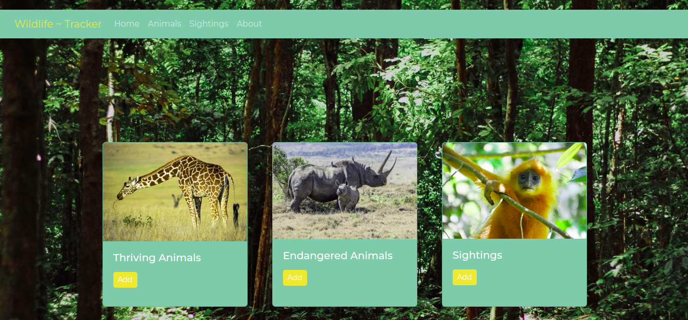

# Wildlife Tracker

## Author

Linet Mutheu

## Demo

### Description

An application that allows Rangers to track wildlife sightings in the area.

### Prerequisites

You need to have the following installed on your machine

1. Java JDK
2. Gradle
3. JDK
4. Maven
5. Java IDE (Intellij)

### Setup and Installation
To access this project on your local files, you can clone it using these steps

1. Open your terminal
2. Use this command to clone `$ git clone
   https://github.com/MutheuLinet/animal-tracker.git
3. This will clone the repository into your local folder
4. Navigate to the folder you cloned into, within src/main/java/App. java and open it with intellij.
5. Go to your browser and type localhost:4567

### Contribution
You may also want to contribute to enhance a functionality:

1. Fork the repository to your GitHub account
2. Create a new branch (git switch -c ft-development)
3. Make the changes you intend
4. Add changes to reflect the changes made
5. Commit your changes (git commit -m 'additional info')
6. Push to the branch (git push origin ft-develop)
7. Create a Pull Request.

### Behavior Driven Development
The user is able to;
1. Run the App on a browser
2. Select the Add ThrivingAnimal, EndangeredAnimal or Sighting tab which will open a form to fill.
3. View the ThrivingAnimal, EndangeredAnimal or Sighting details.
4. Add edit or delete more ThrivingAnimals, EndangeredAnimals or Sightings as possible
   (It also allows a user to Test the output before actual running of the App)

### Running Tests
1. Navigate to the folder you cloned into, within src/test/java/models and open it with intellij. Select the EndangeredAnimalTests, ThrivingAnimalTests or SightingsTests.
2. This is a sample test to check a correct instance of the EndangeredAnimal, ThrivingAnimal and Sightings objects.

@Test

public void getAnimalType_constantTypeProperty_String() {

EndangeredAnimal rhino = new EndangeredAnimal("Rhino","Healthy", "Young");

assertEquals("Endangered_Animal", rhino.getAnimalType());

}

3. Right click within the open test file and run the tests on your terminal.

### SQL
1. Launch postgres
2. Type in psql
Run these commands
3. CREATE DATABASE wildlife_tracker;
4. \c wildlife_tracker;
5. CREATE TABLE animals (id serial PRIMARY KEY, name varchar, health varchar, age varchar, type varchar);
6. CREATE TABLE wildlife_tracker=# CREATE TABLE sightings (id serial PRIMARY KEY, animal_id int, location varchar, ranger_name varchar, timestamp timestamp);
7. CREATE DATABASE wildlife_tracker_test WITH TEMPLATE wildlife_tracker;

### Technologies Used
1. HTML
2. CSS
3. Handlebars
4. Java
5. Gradle
6. Spark
7. Junit

### Live Site
[Live Link]( https://animal-tracker-wildlife.herokuapp.com/)

### License
This project is under the [MIT](LICENSE) licence

### Copyright
Copyright (c) 2022 Linet Mutheu
